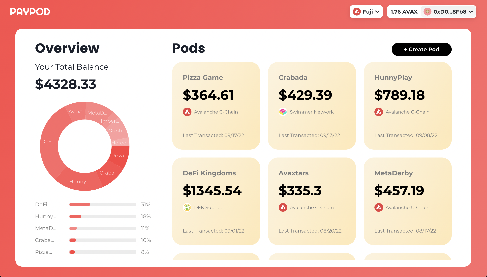

# PayPod

PayPod is a payment smart contract as a service platform for web3 games on Avalanche dedicated to enhancing the in-game payment experience.

This project was built as a submission to the 2022 Avalanche Hackathon.

- Check out the [Live Deployment](https://paypod.games)
- Check out the [Walkthrough Demo](https://vimeo.com/751860444)

## Problem Statement

One of the main bottlenecks to the adoption of web3 gaming is the user experience. Namely, in web3 games when a player has to make a simple token transfer or an update to an on-chain state, the current experience requires players to use their wallet to confirm a transaction in the middle of gameplay which is disruptive to the player experience - as it completely takes them out of the moment. But what if there was a way that in-game payments are as seamless as they are in traditional web2 games?

## Solution: PayPod

That’s why I’ve built PayPod. On the PayPod platform, a pod is a smart contract that acts as an account abstraction for players in web3 games. Like a prepaid card, a user can deposit funds into a pod they’ve created for a specific game, then allow the game’s contracts to control the funds in the pod such that the in-game payment experience becomes truly seamless.

PayPod is a platform that allows users to easily deploy and manage their pods that allows web3 games to handle in-game payments on behalf of the users.

### Features

1. Create a pod for a web3 game of your choice
2. Assign games as controllers to the pod for account management
3. Manage pod balance, ownership, and transaction history
4. Onboarding documents for web3 games to integrate into existing projects

### Onboarding for Web3 Games

- Read more on the [Onboarding Guide for Web3 Games](/Onboarding.md)

### Next Steps

- Add better unit and e2e testing
- Add better responsive design
- Add event indexing for transaction history
- Create example game implementations
- Add better documentation for game onboarding
- Add support for STATICCALL, DELEGATECALL, CREATE2 on PayPod.sol
- Beta testing service with games for feedback
